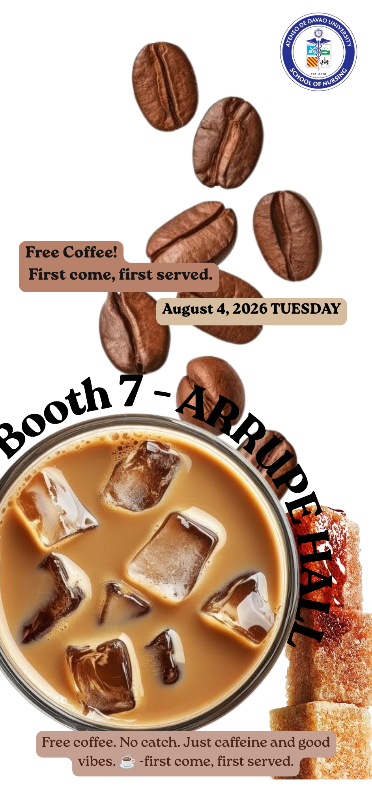

[📖 README](README.md) &nbsp;&nbsp;|&nbsp;&nbsp; [📖 Activity 1](Activity1.md) &nbsp;&nbsp;|&nbsp;&nbsp; [📖 Activity 2](Activity2.md) &nbsp;&nbsp;|&nbsp;&nbsp; [📖 Activity 3](Activity3.md)

# Activity 1: Presentation Design Principles

---

## What I Created ☕✨

  

I designed an event promotional poster for an on-campus community initiative: a free coffee pop-up organized under the **Ateneo de Davao University – School of Nursing**. 

The deliverable is a mobile- and feed-optimized digital flyer announcing the event details:
* **Event:** Free Coffee Pop-Up (*"First come, first served"*)
* **Date:** Tuesday, August 4, 2026
* **Location:** Booth 7 – Arrupe Hall
* **Vibe:** Clean, caffeinated energy tailored for exhausted, hardworking students.

---

## Why I Came Up With the Concept 💡🧠

  

* **The Student Reality:** Healthcare and collegiate academic loads are notoriously demanding. Coffee isn’t just a beverage; it’s an essential fuel line and a micro-break that grounds students during long duty shifts and study grinds.
* **Low Friction, High Appeal:** The core messaging—*"Free coffee. No catch. Just caffeine and good vibes."*—deliberately removes institutional bureaucracy. It speaks peer-to-peer: straightforward, refreshing, and welcoming.
* **Sensory Immersion:** Instead of a generic corporate layout, the concept centers around tactile cravings—the clinking sound of ice floating in rich espresso-and-milk, falling roasted beans, and raw brown sugar cubes. It delivers an instant craving trigger in under two seconds of scrolling.

---

## How I Developed the Final Output 🛠️🎨

  

1. **Asset Selection & Background Isolation:** Sourced a high-resolution top-down perspective of an iced latte, floating coffee beans, and stacked caramelized sugar cubes. Stripped the background into pure white to give the organic elements maximum punch.
2. **Curved Typographic Framing:** Warped the primary location anchor—**"Booth 7 – ARRUPE HALL"**—along the top contour of the coffee glass. This creates a natural circular visual lock between text and subject.
3. **Structured Information Chips:** Pill-shaped, warm taupe tags were overlaid across the falling beans and base to organize the logistics (*date, rules, and hook*) without occluding key visual textures.
4. **Institutional Branding:** Integrated the official institutional seal (Ateneo de Davao University – School of Nursing) at the top right to anchor authority while leaving the creative space uncluttered.

---

## Design Principles Applied 📐🎯

  

* **Focal Point & Emphasis:** The massive iced coffee glass dominates the lower two-thirds of the canvas. The bold, black arched typography (*"Booth 7 – ARRUPE HALL"*) immediately captures the eye and tethers the exact physical location directly to the visual payoff.
* **Movement & Flow:** The scattered, diagonally cascading coffee beans guide the viewer’s eye naturally from the institutional crest at the top right, downward through the date pill, straight into the iced drink below.
* **Contrast & Legibility:** Strong tonal contrast is maintained throughout—deep roasted browns, caramel milk tones, and stark black bold lettering against a clinical white backdrop ensure immediate readability from mobile screens.
* **Proximity & Visual Chunking:** Secondary metadata (*"August 4, 2026 TUESDAY"* and *"First come, first served"*) is encapsulated into muted brown rounded chips, keeping logistical details tightly grouped so they never compete with the hero imagery.
* **Repetition & Color Harmony:** A unified palette drawn directly from the product itself—espresso, cream, kraft taupe, and raw cane sugar—creates a cohesive, warm aesthetic that feels both professional and inviting.

## Output Preview

