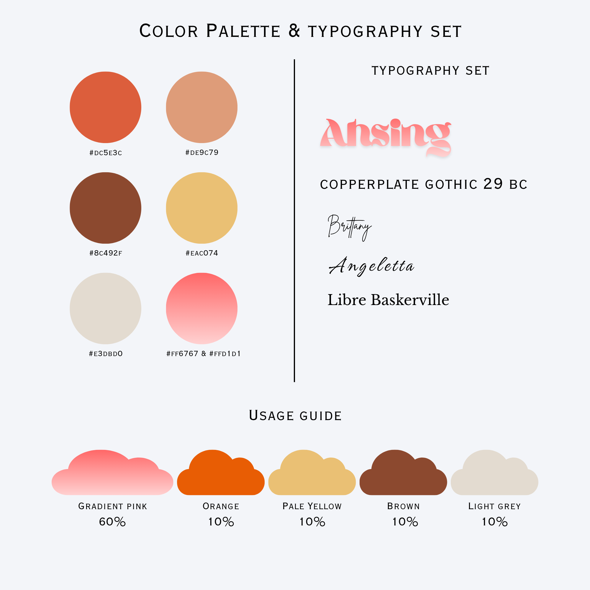

[📖 README](README.md) &nbsp;&nbsp;|&nbsp;&nbsp; [📖 Activity 1](Activity1.md) &nbsp;&nbsp;|&nbsp;&nbsp; [📖 Activity 2](Activity2.md) &nbsp;&nbsp;|&nbsp;&nbsp; [📖 Activity 3](Activity3.md)

# Activity 2: Color Palette and Typography

---

## What I Created

<!-- Describe the color palette and typography system you designed here -->

---

## Why I Came Up With the Concept

<!-- Explain the reasoning or inspiration behind your color and typography choices here -->

---

## How I Developed the Final Output

<!-- Walk through your process — from initial exploration to the final palette and type pairing — here -->

---

## Color Palette

<!-- List your chosen colors (hex codes, names) and explain the meaning or mood behind each one -->

---

## Typography

<!-- Name your chosen fonts, describe their style, and explain why they complement each other and the design -->

---

## Output Preview

