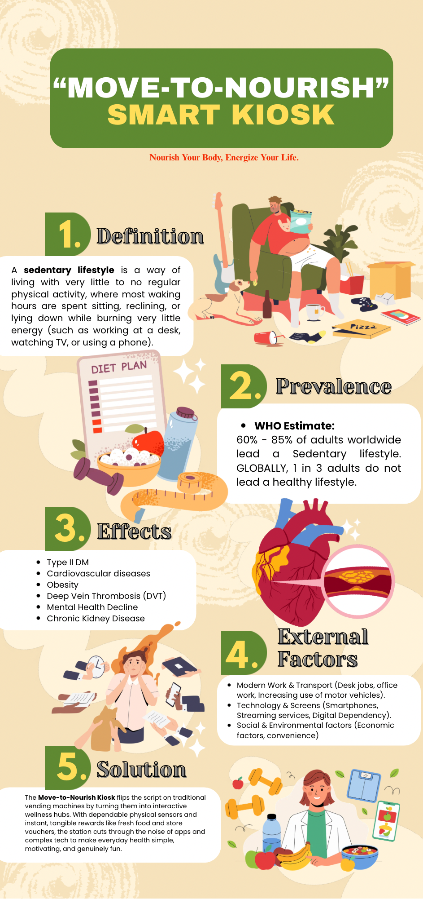

[📖 README](README.md) &nbsp;&nbsp;|&nbsp;&nbsp; [📖 Activity 1](Activity1.md) &nbsp;&nbsp;|&nbsp;&nbsp; [📖 Activity 2](Activity2.md) &nbsp;&nbsp;|&nbsp;&nbsp; [📖 Activity 3](Activity3.md)

# Activity 3: Social Media Infographics and Mini Project Documentation

---

## What I Created

<!-- Describe the social media infographic(s) you designed and what they communicate -->

---

## Why I Came Up With the Concept

<!-- Explain the reasoning, topic choice, and target audience behind your infographic concept -->

---

## How I Developed the Final Output

<!-- Walk through your creative process — from research and sketching to layout and final design -->

---

## Design Choices

<!-- Explain the layout decisions, icons, color usage, and typography specific to this infographic -->

---

## Output Preview

